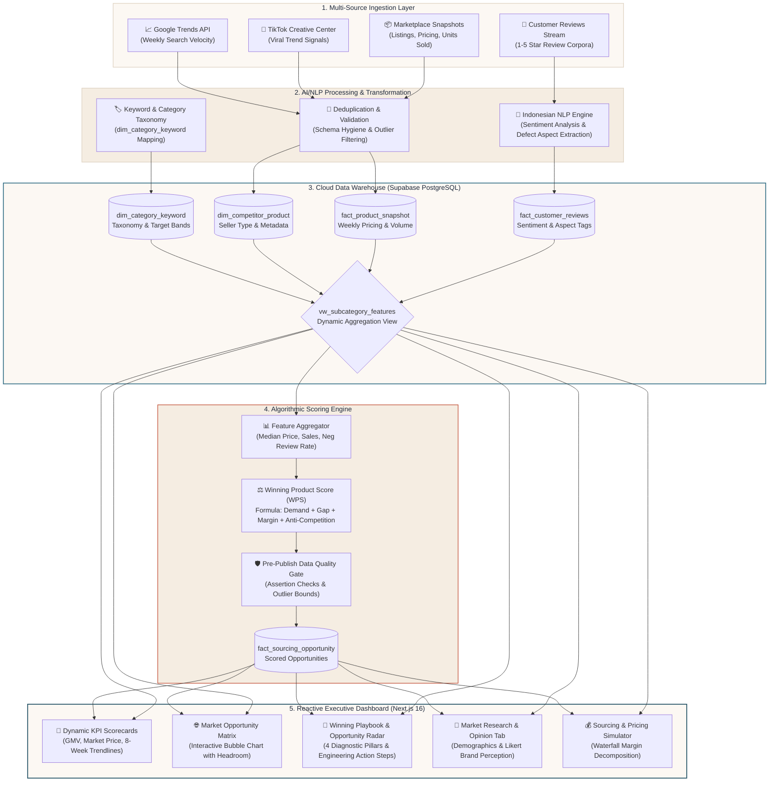

# Biz-In-Sight | Winning Product Discovery & Sourcing Intelligence Engine

[](https://nextjs.org/)
[](https://python.org)
[](https://supabase.com)
[](https://vercel.com)
[](LICENSE)

**An enterprise-grade decision intelligence engine that discovers high-demand e-commerce niches, uncovers unmet consumer complaints, and validates sourcing feasibility before capital deployment.**

---

## 🎯 Executive Overview & Business Value

In Southeast Asian e-commerce marketplaces (Shopee, Tokopedia, TikTok Shop), **over 70% of new product launches fail within 90 days** due to hyper-competitive saturation, price wars, and unforeseen product defects. Sourcing inventory based on intuition or basic best-seller lists leads to dead stock and burned capital.

**Biz-In-Sight** transforms public market data into strategic sourcing intelligence by answering three mission-critical questions:

1. **Where is the market whitespace?** Identifies sub-categories with surging consumer demand, high sales velocity, and low Mall/Brand saturation.
2. **What is the product defect gap?** Leverages NLP sentiment analysis on negative customer reviews to pinpoint competitors' structural flaws (e.g., snapping cable joints, leaking food packaging).
3. **Is the unit economics feasible?** Automatically calculates target COGS (HPP), projected net margins, and break-even pricing tiers against real supplier manufacturing capabilities.

---

## 🧬 End-to-End System Lineage & Architecture

The following data lineage illustrates the complete end-to-end data lifecycle—from multi-source ingestion and NLP processing to automated scoring and dynamic executive visualization:



---

## 🧮 The Winning Product Score (WPS) Formula

Every sub-category is evaluated by a normalized multi-objective scoring formula (0–100 scale) calibrated for Southeast Asian marketplace dynamics:

$$\text{WPS} = 0.35 \times \text{Demand} + 0.25 \times (100 - \text{Competition}) + 0.25 \times \text{Margin} + 0.15 \times \text{Gap}$$

| Dimension | Weight | Mathematical Definition | Strategic Business Meaning |
| :--- | :---: | :--- | :--- |
| **Demand** | **35%** | $\text{Norm}(\text{monthly\_sold\_units} \times \text{search\_trend\_index})$ | Measures current market appetite and search momentum. High volume proves consumer readiness to purchase. |
| **Anti-Competition** | **25%** | $100 - \text{Norm}(\text{mall\_seller\_ratio} \times 100 + \text{avg\_review\_count})$ | Inverted competition score. Favors open markets dominated by non-brand sellers over saturated corporate-dominated niches. |
| **Margin Potential** | **25%** | $\text{Norm}(\text{net\_margin\_pct} \times \text{median\_price})$ | Quantifies profit margin headroom after subtracting standard marketplace commissions (8.5–10%) and estimated ad spend. |
| **Customer Pain Gap** | **15%** | $\text{Norm}(\text{negative\_review\_rate})$ | High negative review ratios (1–2 stars) signal exploitable product weaknesses that superior product engineering can conquer. |

### Decision Tiers
* **WPS $\ge$ 70 — High Priority / Immediate Sourcing**: Strong demand, high margins, and clear consumer pain points with low barrier to entry.
* **WPS 50–69 — Monitor & Sample Testing**: Viable market, but requires deeper competitive pricing validation or supplier negotiation.
* **WPS $<$ 50 — Reject / Saturated**: Overcrowded category with razor-thin margins or declining consumer search velocity.

---

## 📖 Application User Guide

The dashboard is organized into three analytical views designed for executive decision-makers, category managers, and supply chain sourcers.

```
┌──────────────────────────────────────────────────────────────────────────────────┐
│  [Market Landscape & Overview]   [Market Research & Opinion]   [Sourcing Sim]    │
└──────────────────────────────────────────────────────────────────────────────────┘
```

---

### Step 1: Filter Scope & Macro Trends
1. **Scope Filter**: Use the scope selector in the header bar to filter across **All Categories**, **Winning Niches (WPS $\ge$ 70)**, or specific categories (*Elektronik & Gadget*, *Dapur & Makanan*, *Ibu & Kebutuhan Bayi*, etc.).
2. **Dynamic KPI Scorecards**:
   - **Total Market GMV**: Displays aggregated monthly gross merchandise volume.
   - **Average Market Price**: Shows the median market price band.
   - **Sourcing Opportunities**: Tracks the number of actionable high-priority niches.
   - **8-Week Trendlines**: Observe the cubic Bézier curves and dashed historical average (*AVG*) baseline to verify whether the market momentum is accelerating or cooling down.

---

### Step 2: Evaluating the Market Opportunity Matrix (Bubble Chart)
1. Navigate to the **Market Opportunity Analytics** chart in the main panel.
2. **Axis Interpretation**:
   - **X-Axis (Competition Intensity)**: Ranges from low competition (left) to high competition (right).
   - **Y-Axis (Market Demand Index)**: Measures consumer purchase velocity and search trend volume.
   - **Bubble Diameter**: Corresponds to total monthly sales volume.
3. **The Sourcing Sweet-Spot**:
   - Focus on bubbles in the **Top-Left Quadrant** (High Demand, Low-to-Moderate Competition).
   - Hover over any bubble to inspect exact sales numbers, median prices, and category classifications.

---

### Step 3: Executing with the Winning Playbook & Opportunity Radar
On the right-hand panel, the **Winning Playbook** automatically adapts to the chosen filter:

1. **Top Opportunity Target**: Highlights the #1 ranked winning product in the selected segment along with its real-time WPS score.
2. **4 Diagnostic Pillars**:
   - **Pillar 1: Demand Velocity**: Live search surge percentage and monthly unit run-rate.
   - **Pillar 2: Target COGS & Margin**: Maximum allowable manufacturing HPP (`cogs_ratio` $\times$ median price) and target net profit margin.
   - **Pillar 3: Competitor Pain Gap**: Real defect percentage mined from 1–2 star customer reviews (e.g., *Internal Core Snapping 72%*, *Packaging Leaks 50%*).
   - **Pillar 4: OEM / Supplier Readiness**: Target manufacturing hubs (e.g., *Shenzhen & Cikarang OEM*, *Maklon PIRT/BPOM Sidoarjo*).
3. **Actionable Strategy Steps**:
   - **Step 1 (Physical Engineering Upgrade)**: Concrete specification changes needed to solve the top competitor defect.
   - **Step 2 (Sweet-Spot Bundling Strategy)**: Recommended multi-pack pricing calculated dynamically from current median market prices.

---

### Step 4: Investigating Consumer Sentiment (Market Research Tab)
Switch to the **Market Research & Brand Opinion** tab from the sidebar:

1. **Demographics Breakdown**: Review age distribution donut charts and regional purchasing geography.
2. **Brand Awareness Rankings**: Inspect top-of-mind brand recognition across market incumbents.
3. **Brand Perception (Likert Distribution)**: Examine the 5-tier sentiment bars (*Strongly Disagree* to *Strongly Agree*) covering:
   - Trendy Design Perception
   - Durability Under Heavy Use
   - Brand Image & Trustworthiness
4. **Interactive Inspection**: Hover over any bar segment to reveal exact percentage values without UI clutter.

---

### Step 5: Validating Unit Economics (Pricing & Sourcing Simulator Tab)
Switch to the **Sourcing & Margin Simulator** tab:

1. **Input Parameters**:
   - Set **Retail Price (IDR)**, **Supplier Unit Cost (HPP)**, and **Monthly Order Target**.
   - Input **Marketplace Commission Rate** (default: 8.5%), **Advertising Allocation** (default: 10%), and **Packaging/Fulfillment Overhead**.
2. **Waterfall Margin Decomposition**:
   - Visually dissect how each cost component eats into the gross revenue.
   - Ensure the final **Net Profit Margin** exceeds your minimum threshold (recommended: $\ge 25\%$) before committing to a factory purchase order.

---

## 🎨 Design Philosophy & Aesthetic Identity

Biz-In-Sight is built on a custom **Warm Scandinavian Editorial Presentation** design system inspired by executive research publications:

* **Canvas & Surfaces**: Warm Linen (`#f3ece3`), Soft Ivory surfaces (`#fcf8f3`), and Oat Sand inner containers (`#f5ede2`).
* **Signature Accent Tones**: Deep Ocean Teal (`#245366`) for primary metrics, Muted Ocean (`#3b748a`) for secondary trends, and Warm Terracotta (`#c2533a`) for defect/gap alerts.
* **Bilingual Switcher**: Instant zero-reload toggle between **Bahasa Indonesia (ID)** and **English (EN)**.
* **Compact Large Numbers**: Intelligent localization for large monetary figures (`Milyar / Juta` in ID, `Billion / Million` in EN).

---

## 🛡️ Data Compliance & Integrity

* **Public & Aggregated Data**: All intelligence is derived from public datasets, search index APIs, and aggregated e-commerce snapshots. No private marketplace data is accessed or scraped.
* **Dynamic Views**: The system relies on PostgreSQL SQL Views (`vw_subcategory_features`), ensuring that pipeline updates reflect instantly across all analytics cards.
* **Zero Hardcoding**: Sourcing playbooks, defect rates, target COGS, and trend baselines compute dynamically from active database features.

---

<p align="center">
  <b>Biz-In-Sight</b> — Making E-Commerce Sourcing Predictable, Data-Driven, and Profitable.
</p>
