# Biz-In-Sight | Winning Product Discovery & Sourcing Intelligence Engine

[](https://nextjs.org/)
[](https://python.org)
[](https://supabase.com)
[](https://playwright.dev/)
[](https://github.com/features/actions)
[](https://vercel.com)
[](LICENSE)

**An enterprise-grade decision intelligence engine that discovers high-demand e-commerce niches, uncovers unmet consumer complaints, and validates manufacturing feasibility before capital deployment.**

---

## 🎯 Executive Overview & The Problem We Solve

In Southeast Asian e-commerce marketplaces (Shopee, Tokopedia, TikTok Shop), **over 70% of new product launches fail within 90 days** due to hyper-competitive saturation, price wars, and unforeseen product defects. Sourcing inventory based on gut feeling or basic best-seller lists leads to dead stock and burned capital.

**Biz-In-Sight** transforms public market signals into strategic sourcing intelligence by answering three mission-critical questions:

1. **Where is the market whitespace?** Identifies sub-categories with surging consumer demand, high sales velocity, and low Mall/Brand saturation.
2. **What is the product defect gap?** Mines negative customer reviews via NLP sentiment analysis to pinpoint competitors' structural product flaws (e.g., snapping cable joints, leaking food packaging).
3. **Is the unit economics feasible?** Automatically calculates target COGS (HPP), projected net margins, and break-even pricing tiers against real supplier manufacturing capabilities.

---

## 🧬 End-to-End System Lineage & Architecture

The following landscape diagram illustrates the complete end-to-end data lifecycle—from multi-channel ingestion and AI enrichment to automated scoring and executive visualization:

```mermaid
flowchart LR
    %% ── 1. Ingestion Layer ──
    subgraph S1["1. MULTI-SOURCE INGESTION"]
        direction TB
        IN1["🛒 E-Commerce Market Data<br/><b>Shopee & Tokopedia Listings</b><br/><i>Price, Volume, Seller Type</i>"]
        IN2["💬 Customer Review Stream<br/><b>Verified Buyer Feedback</b><br/><i>1-5 Star Ratings & Text Corpora</i>"]
        IN3["📈 Google Trends API<br/><b>Search Demand Velocity</b><br/><i>Weekly Interest & Momentum</i>"]
        IN4["🎵 TikTok Creative Center<br/><b>Automated Social Ingestion</b><br/><i>7D Growth & Video Velocity</i>"]
    end

    %% ── 2. AI Processing Layer ──
    subgraph S2["2. AI & DATA PIPELINE"]
        direction TB
        P1["🧹 Deduplication & Validation<br/><b>Schema Hygiene & Outlier Filter</b>"]
        P2["🧠 Indonesian NLP Engine<br/><b>Sentiment & Defect Extraction</b><br/><i>Quality, Packaging, Durability</i>"]
        P3["🏷️ Sourcing Taxonomy Mapping<br/><b>13 Active Sub-Categories</b><br/><i>Target Bands & COGS Baselines</i>"]
    end

    %% ── 3. Data Warehouse Layer ──
    subgraph S3["3. CLOUD DATA WAREHOUSE"]
        direction TB
        DW_DIMS[("Dimension Tables<br/><b>dim_category_keyword</b><br/><b>dim_competitor_product</b>")]
        DW_FACTS[("Fact Tables (Idempotent)<br/><b>fact_product_snapshot</b><br/><b>fact_customer_reviews</b>")]
        DW_VIEWS{"Dynamic SQL Aggregations<br/><b>vw_subcategory_features</b><br/><b>vw_category_analytics</b>"}
    end

    %% ── 4. Scoring Engine Layer ──
    subgraph S4["4. WPS SCORING ENGINE"]
        direction TB
        WPS1["📊 Omnichannel Trend Blend<br/><i>70% Search Intent + 30% Social Velocity</i>"]
        WPS2["⚖️ Winning Product Score (WPS)<br/><b>Demand + Margin + Anti-Sat + Gap</b>"]
        WPS3["🛡️ Pre-Publish Quality Gate<br/><i>Statistical Bounds & Outlier Checks</i>"]
        DW_OPP[("Opportunity Repository<br/><b>fact_sourcing_opportunity</b>")]
    end

    %% ── 5. Executive UI Layer ──
    subgraph S5["5. EXECUTIVE INTELLIGENCE"]
        direction TB
        UI1["📌 Macro KPI Scorecards<br/><i>GMV, Price Bands, 8W Trends</i>"]
        UI2["🌐 Opportunity Matrix<br/><i>Interactive 4-Quadrant Bubble Map</i>"]
        UI3["🎯 4-Pillar Winning Playbook<br/><i>Demand, HPP, Defect Gap, OEM Hub</i>"]
        UI4["👥 Customer Persona & RFM<br/><i>Demographics, Sentiment & Supply Cities</i>"]
        UI5["💰 Unit Economics Simulator<br/><i>Waterfall Net Margin Decomposition</i>"]
    end

    %% ── Widescreen Horizontal Pipeline Connectors ──
    IN1 & IN2 & IN3 & IN4 --> P1
    P1 --> P2 & P3
    P2 & P3 --> DW_DIMS & DW_FACTS
    DW_DIMS & DW_FACTS --> DW_VIEWS
    DW_VIEWS --> WPS1
    WPS1 --> WPS2 --> WPS3 --> DW_OPP
    DW_OPP & DW_VIEWS --> UI1 & UI2 & UI3 & UI4 & UI5

    %% ── Styling for High-Contrast Executive Presentation ──
    style S1 fill:#fcf8f3,stroke:#3b748a,stroke-width:2px,color:#0f172a
    style S2 fill:#f8fafc,stroke:#64748b,stroke-width:2px,color:#0f172a
    style S3 fill:#f0fdf4,stroke:#16a34a,stroke-width:2px,color:#0f172a
    style S4 fill:#fff7ed,stroke:#ea580c,stroke-width:2px,color:#0f172a
    style S5 fill:#fdf2f8,stroke:#245366,stroke-width:2px,color:#0f172a
```



---

## 🧮 The Winning Product Score (WPS) Formula

Every sub-category is evaluated by a normalized multi-objective scoring formula (0–100 scale) calibrated for Southeast Asian marketplace dynamics:

$$\text{WPS} = 0.35 \times \text{Demand} + 0.25 \times (100 - \text{Competition}) + 0.25 \times \text{Margin} + 0.15 \times \text{Gap}$$

| Dimension | Weight | Mathematical Formulation | Strategic Business Value |
| :--- | :---: | :--- | :--- |
| **Omnichannel Demand** | **35%** | $\text{Norm}(\text{monthly\_sold\_units} \times \text{omnichannel\_trend\_index})$ | Blends **Google Search Intent (70%)** and **TikTok Viral Velocity (30%)** to confirm genuine consumer appetite before sourcing. |
| **Anti-Competition** | **25%** | $100 - \text{Norm}(\text{mall\_seller\_ratio} \times 100 + \text{avg\_review\_count})$ | Inverted competition index. Favors open markets dominated by non-brand sellers over saturated corporate-dominated niches. |
| **Margin Potential** | **25%** | $\text{Norm}(\text{net\_margin\_pct} \times \text{median\_price})$ | Quantifies profit margin headroom after subtracting marketplace commissions (8.5–10%) and estimated ad spend against target HPP. |
| **Customer Pain Gap** | **15%** | $\text{Norm}(\text{negative\_review\_rate})$ | High negative review ratios (1–2 stars) signal exploitable competitor defects that superior product engineering can conquer. |

### Sourcing Decision Tiers
* **WPS $\ge$ 70 — High Priority / Immediate Sourcing**: Strong demand, healthy margins, and clear consumer pain points with low barrier to entry.
* **WPS 50–69 — Monitor & Sample Testing**: Viable market, but requires deeper competitive pricing validation or supplier negotiation.
* **WPS $<$ 50 — Reject / Saturated**: Overcrowded category with razor-thin margins or declining consumer search velocity.

---

## 🚀 Key Modules & Engineering Advancements

### 1. Automated TikTok Creative Center Ingestion (C4)
* **Headless Automation**: Implemented [`scripts/fetch_tiktok_trends.py`](scripts/fetch_tiktok_trends.py) powered by **Playwright (Chromium)** to intercept internal trend metrics and automatically refresh [`data/raw/tiktok_weekly_trends.csv`](data/raw/tiktok_weekly_trends.csv).
* **Multi-Tier Fallback Architecture**:
  1. *Tier 1*: Official TikTok Research API via client credentials.
  2. *Tier 2*: Session-authenticated requests with `TIKTOK_SESSION_COOKIE`.
  3. *Tier 3*: Automated weekly CSV export ingestion.
  4. *Tier 4*: Calibrated 13-subcategory baseline for Southeast Asian social commerce.
* **Omnichannel DB Blend**: Automatically merges TikTok `weekly_velocity_score` into Supabase `fact_product_snapshot.search_trend_index`.

### 2. Expanded E-Commerce Dataset (C1)
* Covers **13 active sub-categories** across 6 core retail sectors:
  * **Elektronik & Gadget**: *Kabel Fast Charging Braided*, *Earphone Gaming Murah*
  * **Dapur & Makanan**: *Bumbu Instan Nusantara*, *Rak Bumbu Dapur Minimalis*, *Saringan Minyak Goreng*
  * **Otomotif & Pengendara**: *Holder HP Motor Anti Getar*
  * **Ibu & Kebutuhan Bayi**: *Botol Susu Anti Kolik BPA Free*
  * **Peralatan Rumah**: *Talenan Kayu*, *Rak Sepatu Minimalis*, *Organizer Laci Kamar*
  * **Kecantikan & Skincare**: *Serum Pencerah Wajah*, *Organizer Makeup Meja Rias*, *Cermin Kaca Rias*
* Ingestion of **65 competitor products** and **232 verified customer reviews**.

### 3. Dynamic Customer Analytics & RFM Engine (C2/C3)
* Powered by SQL View `vw_category_analytics` in Supabase PostgreSQL:
  * Computes dynamic customer demographics (age distribution, repeat buyer tier).
  * Calculates real-time sentiment distribution and Likert brand perception.
  * Aggregates primary supply chain origins (*Jakarta Barat, Surabaya, Bandung, Tangerang*).

### 4. Idempotent Data Architecture & Scheduling (C8 & C9)
* **Strict Unique Constraints**: Enforces `UNIQUE (keyword_id, pipeline_run_id)` and `UNIQUE (product_id, snapshot_date)`, guaranteeing zero duplicate rows on pipeline reruns.
* **GitHub Actions CI/CD Scheduler**: Automatically runs every Monday at 01:00 UTC via [`.github/workflows/weekly_pipeline.yml`](.github/workflows/weekly_pipeline.yml), executing Playwright browser extraction, trends ingestion, NLP enrichment, WPS scoring, and automated DB verification.
* **Fixed Weekly Calendar Window**: Locks trend benchmarking to calendar-locked cycles (Senin–Minggu / e.g. Sep 08 – Sep 15, 2026), preventing daily metric drift.

---

## 📖 Executive Dashboard User Guide

The dashboard is organized into three analytical views designed for category managers, sourcing leads, and business executives:

```
┌──────────────────────────────────────────────────────────────────────────────────┐
│  [Market Landscape & Overview]   [Market Research & Opinion]   [Sourcing Sim]    │
└──────────────────────────────────────────────────────────────────────────────────┘
```

### View 1: Market Landscape & Opportunity Matrix
1. **Scope Filter**: Filter by *All Categories*, *Winning Niches (WPS $\ge$ 70)*, or specific retail sectors.
2. **Dynamic KPI Scorecards**: Total Market GMV, Median Price Band, Number of Opportunities, and 8-Week cubic Bézier trendlines.
3. **Interactive Bubble Chart**:
   - **X-Axis**: Competition Intensity (left = low competition, right = high saturation).
   - **Y-Axis**: Market Demand Index (sales velocity + search momentum).
   - **Bubble Size**: Monthly sales volume.
   - **Sweet Spot**: Top-Left quadrant represents high-demand, low-competition whitespace.
4. **4-Pillar Winning Playbook**:
   - Live demand velocity, target COGS/HPP, competitor pain gap mining, and OEM supplier recommendations.

### View 2: Customer Personas & Market Research
1. **Demographic Profiles**: Age cohort donut charts and RFM customer lifetime indicators.
2. **Sentiment & Brand Perception**: 5-tier Likert scale distribution covering *Design*, *Durability*, and *Trustworthiness*.
3. **Supply Chain Footprint**: Regional distribution of dominant sellers across Indonesia.

### View 3: Unit Economics & Sourcing Simulator
1. **Customizable Inputs**: Retail Price, Supplier Unit Cost (HPP), Order Volume, Marketplace Fee (8.5–10%), and Ad Spend Allocation.
2. **Waterfall Margin Decomposition**: Visual step-by-step breakdown of cost deduction to verify net profit margins exceed target thresholds ($\ge 25\%$).

---

## 📂 Repository Structure

```text
Winning-Product-Discovery-Engine/
├── .github/workflows/
│   └── weekly_pipeline.yml        # GitHub Actions CI/CD weekly scheduler (Monday 01:00 UTC)
├── dashboard/                     # Next.js 16 Executive Presentation Web Application
│   ├── app/                       # App Router & page components
│   ├── components/                # Scorecards, BubbleChart, CustomerInfoSection, Simulator
│   └── lib/                       # Supabase client, queries, types, and localization
├── data/
│   ├── cache/                     # Weekly trend & scoring snapshot caches
│   └── raw/                       # products.csv, reviews.csv, tiktok_weekly_trends.csv
├── pipeline/
│   ├── discovery/                 # Keyword discovery and category expansion
│   ├── ingestion/                 # kaggle_loader.py, trends_ingestion.py, tiktok_trends.py
│   ├── processing/                # nlp_pipeline.py (Indonesian sentiment & defect tagging)
│   ├── quality/                   # data_quality_checks.py (pre-publish assertion gate)
│   ├── scoring/                   # feature_aggregation.py, winning_product_score.py
│   └── run_all.py                 # Master pipeline orchestration script
├── scripts/
│   └── fetch_tiktok_trends.py     # Playwright headless browser automated trend extractor
├── sql/
│   ├── 01_ddl_dimensions.sql      # dim_category_keyword, dim_competitor_product
│   ├── 02_ddl_facts.sql           # fact_product_snapshot, fact_customer_reviews
│   ├── 03_ddl_scoring.sql         # fact_sourcing_opportunity
│   ├── 04_view_subcategory_features.sql # Bridge view for Python scoring engine
│   ├── 05_migration_unique_scoring.sql  # Idempotent unique constraints
│   ├── 06_view_category_analytics.sql   # Customer analytics & demographics view
│   └── 07_seed_missing_keywords.sql     # Seed taxonomy data
└── requirements.txt               # Core Python dependencies
```

---

## ⚡ Quickstart & Local Reproduction

### 1. Clone & Environment Setup
```bash
git clone https://github.com/your-org/Winning-Product-Discovery-Engine.git
cd Winning-Product-Discovery-Engine

# Copy environment variables
cp .env.example .env
# Set DATABASE_URL with your Supabase PostgreSQL connection string
```

### 2. Install Python Dependencies & Playwright Browser
```bash
pip install -r requirements.txt
playwright install --with-deps chromium
```

### 3. Run the Full Sourcing Intelligence Pipeline
```bash
python pipeline/run_all.py
```
*Executes all 6 steps: Kaggle Data Ingestion -> Google Trends -> TikTok Playwright Extraction & Blend -> Indonesian NLP Enrichment -> Feature Aggregation -> WPS Scoring -> Data Quality Gate.*

### 4. Launch the Executive Dashboard
```bash
cd dashboard
npm install
npm run dev
```
Open [http://localhost:3000](http://localhost:3000) (or `http://localhost:3005`) to view the interactive application.

---

## 🎨 Design Philosophy & Aesthetic Identity

Biz-In-Sight is built on a **Warm Scandinavian Editorial Presentation** design system:

* **Surfaces**: Warm Linen (`#f3ece3`), Soft Ivory surfaces (`#fcf8f3`), and Oat Sand containers (`#f5ede2`).
* **Accent Tones**: Deep Ocean Teal (`#245366`) for primary metrics, Muted Ocean (`#3b748a`) for secondary trends, and Warm Terracotta (`#c2533a`) for defect/gap alerts.
* **Bilingual Localization**: Instant zero-reload toggle between **Bahasa Indonesia (ID)** and **English (EN)**.
* **Compact Large Numbers**: Intelligent localization for large figures (`Milyar / Juta` in ID, `Billion / Million` in EN).

---

<p align="center">
  <b>Biz-In-Sight</b> — Making E-Commerce Sourcing Predictable, Data-Driven, and Profitable.
</p>
