# Biz-In-Sight | Winning Product Discovery & Sourcing Intelligence Engine

[](https://nextjs.org/)
[](https://python.org)
[](https://supabase.com)
[](https://playwright.dev/)
[](https://github.com/features/actions)
[](https://vercel.com)
[](LICENSE)

**An enterprise-grade decision intelligence engine that discovers high-demand e-commerce niches, uncovers unmet consumer complaints, and validates manufacturing feasibility before capital deployment.**

---

## 🎯 Executive Overview & The Problem We Solve

In Southeast Asian e-commerce marketplaces (Shopee, Tokopedia, TikTok Shop), **over 70% of new product launches fail within 90 days** due to hyper-competitive saturation, price wars, and unforeseen product defects. Sourcing inventory based on gut feeling or basic best-seller lists leads to dead stock and burned capital.

**Biz-In-Sight** transforms public market signals into strategic sourcing intelligence by answering three mission-critical questions:

1. **Where is the market whitespace?** Identifies sub-categories with surging consumer demand, high sales velocity, and low Mall/Brand saturation.
2. **What is the product defect gap?** Mines negative customer reviews via NLP sentiment analysis to pinpoint competitors' structural product flaws (e.g., snapping cable joints, leaking food packaging).
3. **Is the unit economics feasible?** Automatically calculates target COGS (HPP), projected net margins, and break-even pricing tiers against real supplier manufacturing capabilities.

---

## 🧬 End-to-End System Lineage & Architecture

The following landscape diagram illustrates the complete end-to-end data lifecycle—from multi-channel ingestion and AI enrichment to automated scoring and executive visualization:

```mermaid
flowchart LR
    %% ── 1. Ingestion Layer ──
    subgraph S1["1. MULTI-SOURCE INGESTION"]
        direction TB
        IN1["🛒 E-Commerce Market Data<br/><b>Shopee & Tokopedia Listings</b><br/><i>Price, Volume, Seller Type</i>"]
        IN2["💬 Customer Review Stream<br/><b>Verified Buyer Feedback</b><br/><i>1-5 Star Ratings & Text Corpora</i>"]
        IN3["📈 Google Trends API<br/><b>Search Demand Velocity</b><br/><i>Weekly Interest & Momentum</i>"]
        IN4["🎵 TikTok Creative Center<br/><b>Automated Social Ingestion</b><br/><i>7D Growth & Video Velocity</i>"]
    end

    %% ── 2. AI Processing Layer ──
    subgraph S2["2. AI & DATA PIPELINE"]
        direction TB
        P1["🧹 Deduplication & Validation<br/><b>Schema Hygiene & Outlier Filter</b>"]
        P2["🧠 Indonesian NLP Engine<br/><b>Sentiment & Defect Extraction</b><br/><i>Quality, Packaging, Durability</i>"]
        P3["🏷️ Sourcing Taxonomy Mapping<br/><b>13 Active Sub-Categories</b><br/><i>Target Bands & COGS Baselines</i>"]
    end

    %% ── 3. Data Warehouse Layer ──
    subgraph S3["3. CLOUD DATA WAREHOUSE"]
        direction TB
        DW_DIMS[("Dimension Tables<br/><b>dim_category_keyword</b><br/><b>dim_competitor_product</b>")]
        DW_FACTS[("Fact Tables (Idempotent)<br/><b>fact_product_snapshot</b><br/><b>fact_customer_reviews</b>")]
        DW_VIEWS{"Dynamic SQL Aggregations<br/><b>vw_subcategory_features</b><br/><b>vw_category_analytics</b>"}
    end

    %% ── 4. Scoring Engine Layer ──
    subgraph S4["4. WPS SCORING ENGINE"]
        direction TB
        WPS1["📊 Omnichannel Trend Blend<br/><i>70% Search Intent + 30% Social Velocity</i>"]
        WPS2["⚖️ Winning Product Score (WPS)<br/><b>Demand + Margin + Anti-Sat + Gap</b>"]
        WPS3["🛡️ Pre-Publish Quality Gate<br/><i>Statistical Bounds & Outlier Checks</i>"]
        DW_OPP[("Opportunity Repository<br/><b>fact_sourcing_opportunity</b>")]
    end

    %% ── 5. Executive UI Layer ──
    subgraph S5["5. EXECUTIVE INTELLIGENCE"]
        direction TB
        UI1["📌 Macro KPI Scorecards<br/><i>GMV, Price Bands, 8W Trends</i>"]
        UI2["🌐 Opportunity Matrix<br/><i>Interactive 4-Quadrant Bubble Map</i>"]
        UI3["🎯 4-Pillar Winning Playbook<br/><i>Demand, HPP, Defect Gap, OEM Hub</i>"]
        UI4["👥 Customer Persona & RFM<br/><i>Demographics, Sentiment & Supply Cities</i>"]
        UI5["💰 Unit Economics Simulator<br/><i>Waterfall Net Margin Decomposition</i>"]
    end

    %% ── Widescreen Horizontal Pipeline Connectors ──
    IN1 & IN2 & IN3 & IN4 --> P1
    P1 --> P2 & P3
    P2 & P3 --> DW_DIMS & DW_FACTS
    DW_DIMS & DW_FACTS --> DW_VIEWS
    DW_VIEWS --> WPS1
    WPS1 --> WPS2 --> WPS3 --> DW_OPP
    DW_OPP & DW_VIEWS --> UI1 & UI2 & UI3 & UI4 & UI5

    %% ── Styling for High-Contrast Executive Presentation ──
    style S1 fill:#fcf8f3,stroke:#3b748a,stroke-width:2px,color:#0f172a
    style S2 fill:#f8fafc,stroke:#64748b,stroke-width:2px,color:#0f172a
    style S3 fill:#f0fdf4,stroke:#16a34a,stroke-width:2px,color:#0f172a
    style S4 fill:#fff7ed,stroke:#ea580c,stroke-width:2px,color:#0f172a
    style S5 fill:#fdf2f8,stroke:#245366,stroke-width:2px,color:#0f172a
```



---

## 🧮 The Winning Product Score (WPS) Framework

Every sub-category is evaluated by a normalized multi-objective scoring formula (0–100 scale) calibrated for Southeast Asian e-commerce marketplace dynamics:

```text
┌───────────────────────────────────────────────────────────────────────────────────────────────────────┐
│                                   WINNING PRODUCT SCORE (WPS) FORMULA                                 │
│                                                                                                       │
│   WPS = [ 0.35 × Demand ] + [ 0.25 × (100 − Competition) ] + [ 0.25 × Margin ] + [ 0.15 × Gap ]       │
│                                                                                                       │
│   • Scale: 0 – 100 Points                                                                             │
│   • Multi-Objective Optimization: Balances Volume, Defensibility, Profitability, and Differentiation │
└───────────────────────────────────────────────────────────────────────────────────────────────────────┘
```

---

### Deep-Dive: The 4 Diagnostic Sourcing Pillars

```
                     ┌────────────────────────────────────────────────────────┐
                     │            WINNING PRODUCT SCORE (100 pts)             │
                     └───────────────────────────┬────────────────────────────┘
         ┌───────────────────────┬───────────────┴───────────────┬───────────────────────┐
         ▼                       ▼                               ▼                       ▼
 ┌───────────────┐       ┌───────────────┐               ┌───────────────┐       ┌───────────────┐
 │   1. DEMAND   │       │2. ANTI-COMPET.│               │   3. MARGIN   │       │ 4. DEFECT GAP │
 │  Weight: 35%  │       │  Weight: 25%  │               │  Weight: 25%  │       │  Weight: 15%  │
 └───────┬───────┘       └───────┬───────┘               └───────┬───────┘       └───────┬───────┘
         │                       │                               │                       │
         ▼                       ▼                               ▼                       ▼
  • Monthly Sales         • Mall Seller Ratio             • Median Price          • 1-2 Star Reviews
  • Google Trends 7D      • Competitor Review Count       • Target COGS (HPP)     • NLP Defect Mining
  • TikTok Viral Buzz     • Market Fragmentation          • Net Margin (≥25%)     • Engineering Flaws
```

#### 1. 📈 Omnichannel Demand Velocity (Weight: 35%)
* **Strategic Business Meaning**: Confirms genuine consumer purchase appetite before committing manufacturing capital, filtering out "empty buzz" that does not translate into sales.
* **Under the Hood**:
  * **Sales Volume**: Total monthly units sold aggregated across market listings.
  * **Omnichannel Trend Blend**: Blends **Google Search Intent (70%)** for deliberate buying intent with **TikTok Viral Velocity (30%)** for emerging social momentum.
* **Calculation**: `Normalize(Monthly Units Sold × Omnichannel Trend Index)`
* **Ideal Sourcing Signal**: Sub-categories with accelerating 7-day momentum and sustained monthly unit volume (>5,000 units/mo).

#### 2. 🛡️ Anti-Competition Whitespace (Weight: 25%)
* **Strategic Business Meaning**: Inverted competition index that favors open markets accessible to independent challenger brands over niches monopolized by corporate mega-brands.
* **Under the Hood**:
  * **Mall Seller Penetration**: Proportion of listings held by official Mall/Brand accounts.
  * **Review Barrier**: Average review count of incumbent listings (high review counts create formidable social proof moats).
* **Calculation**: `100 − Normalize((Mall Seller Ratio × 100) + Average Review Count)`
* **Ideal Sourcing Signal**: Markets dominated by non-mall sellers with moderate review counts (<500 reviews/listing), leaving room for rapid ranking.

#### 3. 💰 Margin & Unit Economics Feasibility (Weight: 25%)
* **Strategic Business Meaning**: Validates real financial profitability after accounting for factory manufacturing costs (HPP), marketplace commissions (8.5–10%), packaging, and customer acquisition costs (CAC).
* **Under the Hood**:
  * **Median Market Price**: Realistic retail selling price band.
  * **Target Manufacturing HPP**: Maximum allowable factory sourcing cost (`cogs_ratio` × median price).
  * **Platform Fees & Ads**: Marketplace transaction fees (8.5–10%) and allocated advertising budget (~10%).
* **Calculation**: `Normalize(Net Margin % × Median Price)`
* **Ideal Sourcing Signal**: Sub-categories where projected net profit margins exceed **≥ 25%** at target retail price points.

#### 4. 🔍 Competitor Product Defect Gap (Weight: 15%)
* **Strategic Business Meaning**: Mines negative buyer reviews via Indonesian NLP to identify structural flaws in existing best-sellers, providing a precise roadmap for product differentiation.
* **Under the Hood**:
  * **NLP Sentiment Ratio**: Proportion of 1-star and 2-star reviews in the category.
  * **Aspect Classification**: Automated categorization of complaints (*Material Quality, Packaging Leaks, Durability, Cable Snapping*).
* **Calculation**: `Normalize(Negative Review Rate)`
* **Ideal Sourcing Signal**: Negative review rate > 12% centered on fixable engineering flaws (e.g. reinforced braided joints, leakproof double seal).

---

### Summary Evaluation Matrix

| Sourcing Pillar | Weight | Primary Data Signals | Target Sweet Spot | Strategic Business Value |
| :--- | :---: | :--- | :--- | :--- |
| **1. Omnichannel Demand** | **35%** | Monthly Sales + Google Trends (70%) + TikTok (30%) | High unit velocity + rising 7D search momentum | Proves consumer willingness to pay |
| **2. Anti-Competition** | **25%** | Mall Seller Ratio + Competitor Review Counts | Low Mall share + fragmented incumbent reviews | Confirms low barrier to market entry |
| **3. Margin Potential** | **25%** | Median Retail Price vs. Manufacturing Target HPP | Projected Net Margin ≥ 25% | Guarantees unit-level business viability |
| **4. Defect Gap** | **15%** | Negative Review Rate (1–2 Stars) + NLP Aspect Tags | High defect rate on specific structural flaws | Provides clear product upgrade blueprint |

---

### Sourcing Decision Framework

```text
┌───────────────┬──────────────────────────────────┬──────────────────────────────────────────────────────────┐
│ WPS Score     │ Decision Tier                    │ Recommended Executive Action                             │
├───────────────┼──────────────────────────────────┼──────────────────────────────────────────────────────────┤
│ ≥ 70 Points   │ 🟢 High Priority Sourcing        │ Issue Supplier RFQ & Factory Sampling Immediately       │
│ 50 – 69 Points│ 🟡 Monitor & Sample Validation   │ Negotiate Target HPP & Validate Packaging Costs          │
│ < 50 Points   │ 🔴 Reject / Saturated Category   │ Avoid Capital Deployment; Market is Monopolized/Declining│
└───────────────┴──────────────────────────────────┴──────────────────────────────────────────────────────────┘
```

---

## 🚀 Key Modules & Technical Capabilities

### 1. Social Commerce Trend Automation (TikTok Creative Center)
* **Headless Browser Extraction**: Implemented [`scripts/fetch_tiktok_trends.py`](scripts/fetch_tiktok_trends.py) powered by **Playwright (Chromium)** to intercept internal trend metrics and automatically refresh [`data/raw/tiktok_weekly_trends.csv`](data/raw/tiktok_weekly_trends.csv).
* **Multi-Tier Fallback Architecture**:
  1. *Tier 1*: Official TikTok Research API via client credentials.
  2. *Tier 2*: Session-authenticated requests with `TIKTOK_SESSION_COOKIE`.
  3. *Tier 3*: Automated weekly CSV export ingestion.
  4. *Tier 4*: Calibrated 13-subcategory baseline for Southeast Asian social commerce.
* **Omnichannel Trend Fusion**: Automatically merges TikTok `weekly_velocity_score` with Google Trends into Supabase `fact_product_snapshot.search_trend_index`.

### 2. Multi-Sector Indonesian Marketplace Coverage
* Comprehensive tracking across **13 active sub-categories** spanning 6 core e-commerce sectors:
  * **Elektronik & Gadget**: *Kabel Fast Charging Braided*, *Earphone Gaming Murah*
  * **Dapur & Makanan**: *Bumbu Instan Nusantara*, *Rak Bumbu Dapur Minimalis*, *Saringan Minyak Goreng*
  * **Otomotif & Pengendara**: *Holder HP Motor Anti Getar*
  * **Ibu & Kebutuhan Bayi**: *Botol Susu Anti Kolik BPA Free*
  * **Peralatan Rumah**: *Talenan Kayu*, *Rak Sepatu Minimalis*, *Organizer Laci Kamar*
  * **Kecantikan & Skincare**: *Serum Pencerah Wajah*, *Organizer Makeup Meja Rias*, *Cermin Kaca Rias*
* Automated ingestion of **65 competitor products** and **232 verified buyer reviews**.

### 3. Real-Time Customer Persona & RFM Analytics
* Powered by dynamic SQL View `vw_category_analytics` in Supabase PostgreSQL:
  * Computes dynamic customer demographics (age distribution, repeat buyer tier).
  * Calculates real-time sentiment distribution and Likert brand perception.
  * Aggregates primary supply chain origins (*Jakarta Barat, Surabaya, Bandung, Tangerang*).

### 4. Idempotent Lakehouse Architecture & Automated Scheduling
* **Strict Unique Constraints**: Enforces `UNIQUE (keyword_id, pipeline_run_id)` and `UNIQUE (product_id, snapshot_date)`, guaranteeing zero duplicate records upon pipeline reruns.
* **GitHub Actions CI/CD Scheduler**: Automatically executes every Monday at 01:00 UTC via [`.github/workflows/weekly_pipeline.yml`](.github/workflows/weekly_pipeline.yml), triggering Playwright browser extraction, trends ingestion, NLP enrichment, WPS scoring, and automated DB verification.
* **Fixed Weekly Calendar Window**: Locks trend benchmarking to calendar-locked cycles (Senin–Minggu / e.g. Sep 08 – Sep 15, 2026), preventing daily metric drift.

---

## 📖 Executive Dashboard User Guide

The dashboard is organized into three analytical views designed for category managers, sourcing leads, and business executives:

```
┌──────────────────────────────────────────────────────────────────────────────────┐
│  [Market Landscape & Overview]   [Market Research & Opinion]   [Sourcing Sim]    │
└──────────────────────────────────────────────────────────────────────────────────┘
```

### View 1: Market Landscape & Opportunity Matrix
1. **Scope Filter**: Filter by *All Categories*, *Winning Niches (WPS ≥ 70)*, or specific retail sectors.
2. **Dynamic KPI Scorecards**: Total Market GMV, Median Price Band, Number of Opportunities, and 8-Week cubic Bézier trendlines.
3. **Interactive Bubble Chart**:
   - **X-Axis**: Competition Intensity (left = low competition, right = high saturation).
   - **Y-Axis**: Market Demand Index (sales velocity + search momentum).
   - **Bubble Size**: Monthly sales volume.
   - **Sweet Spot**: Top-Left quadrant represents high-demand, low-competition whitespace.
4. **4-Pillar Winning Playbook**:
   - Live demand velocity, target COGS/HPP, competitor pain gap mining, and OEM supplier recommendations.

### View 2: Customer Personas & Market Research
1. **Demographic Profiles**: Age cohort donut charts and RFM customer lifetime indicators.
2. **Sentiment & Brand Perception**: 5-tier Likert scale distribution covering *Design*, *Durability*, and *Trustworthiness*.
3. **Supply Chain Footprint**: Regional distribution of dominant sellers across Indonesia.

### View 3: Unit Economics & Sourcing Simulator
1. **Customizable Inputs**: Retail Price, Supplier Unit Cost (HPP), Order Volume, Marketplace Fee (8.5–10%), and Ad Spend Allocation.
2. **Waterfall Margin Decomposition**: Visual step-by-step breakdown of cost deduction to verify net profit margins exceed target thresholds (≥ 25%).

---

## 📂 Repository Structure

```text
Winning-Product-Discovery-Engine/
├── .github/workflows/
│   └── weekly_pipeline.yml        # GitHub Actions CI/CD weekly scheduler (Monday 01:00 UTC)
├── dashboard/                     # Next.js 16 Executive Presentation Web Application
│   ├── app/                       # App Router & page components
│   ├── components/                # Scorecards, BubbleChart, CustomerInfoSection, Simulator
│   └── lib/                       # Supabase client, queries, types, and localization
├── data/
│   ├── cache/                     # Weekly trend & scoring snapshot caches
│   └── raw/                       # products.csv, reviews.csv, tiktok_weekly_trends.csv
├── pipeline/
│   ├── discovery/                 # Keyword discovery and category expansion
│   ├── ingestion/                 # kaggle_loader.py, trends_ingestion.py, tiktok_trends.py
│   ├── processing/                # nlp_pipeline.py (Indonesian sentiment & defect tagging)
│   ├── quality/                   # data_quality_checks.py (pre-publish assertion gate)
│   ├── scoring/                   # feature_aggregation.py, winning_product_score.py
│   └── run_all.py                 # Master pipeline orchestration script
├── scripts/
│   └── fetch_tiktok_trends.py     # Playwright headless browser automated trend extractor
├── sql/
│   ├── 01_ddl_dimensions.sql      # dim_category_keyword, dim_competitor_product
│   ├── 02_ddl_facts.sql           # fact_product_snapshot, fact_customer_reviews
│   ├── 03_ddl_scoring.sql         # fact_sourcing_opportunity
│   ├── 04_view_subcategory_features.sql # Bridge view for Python scoring engine
│   ├── 05_migration_unique_scoring.sql  # Idempotent unique constraints
│   ├── 06_view_category_analytics.sql   # Customer analytics & demographics view
│   └── 07_seed_missing_keywords.sql     # Seed taxonomy data
└── requirements.txt               # Core Python dependencies
```

---

## ⚡ Quickstart & Local Reproduction

### 1. Clone & Environment Setup
```bash
git clone https://github.com/your-org/Winning-Product-Discovery-Engine.git
cd Winning-Product-Discovery-Engine

# Copy environment variables
cp .env.example .env
# Set DATABASE_URL with your Supabase PostgreSQL connection string
```

### 2. Install Python Dependencies & Playwright Browser
```bash
pip install -r requirements.txt
playwright install --with-deps chromium
```

### 3. Run the Full Sourcing Intelligence Pipeline
```bash
python pipeline/run_all.py
```
*Executes all 6 steps: Kaggle Data Ingestion -> Google Trends -> TikTok Playwright Extraction & Blend -> Indonesian NLP Enrichment -> Feature Aggregation -> WPS Scoring -> Data Quality Gate.*

### 4. Launch the Executive Dashboard
```bash
cd dashboard
npm install
npm run dev
```
Open [http://localhost:3000](http://localhost:3000) (or `http://localhost:3005`) to view the interactive application.

---

## 🎨 Design Philosophy & Aesthetic Identity

Biz-In-Sight is built on a **Warm Scandinavian Editorial Presentation** design system:

* **Surfaces**: Warm Linen (`#f3ece3`), Soft Ivory surfaces (`#fcf8f3`), and Oat Sand containers (`#f5ede2`).
* **Accent Tones**: Deep Ocean Teal (`#245366`) for primary metrics, Muted Ocean (`#3b748a`) for secondary trends, and Warm Terracotta (`#c2533a`) for defect/gap alerts.
* **Bilingual Localization**: Instant zero-reload toggle between **Bahasa Indonesia (ID)** and **English (EN)**.
* **Compact Large Numbers**: Intelligent localization for large figures (`Milyar / Juta` in ID, `Billion / Million` in EN).

---

<p align="center">
  <b>Biz-In-Sight</b> — Making E-Commerce Sourcing Predictable, Data-Driven, and Profitable.
</p>
